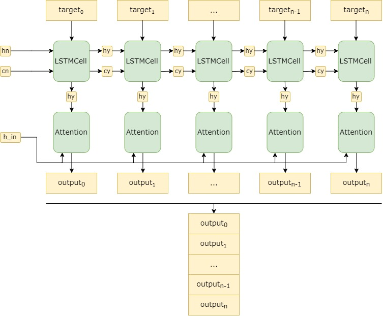
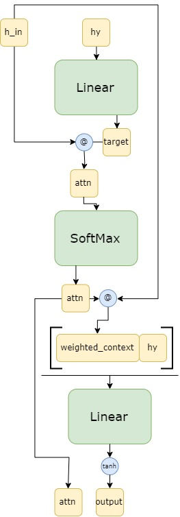

## Table of Contents  
[Model Architecture](#methodology)  
[Results](#results)  
[Error Analysys](#errors)  
[ToDo](#todo)  
[References](#references)  

## Model Architecture

The model is a Seq2Seq decoder with the following general structure:

#### Encoder

##### Transform

#### Decoder

##### Attention

**@** - batch matrix-matrix product (https://pytorch.org/docs/stable/torch.html?highlight=torch%20bmm#torch.bmm)

### Modified Architecture

To introduce the inputs from the rule-based lemmatizer, we added the second encoder and combined the outputs of two encoders before passing them into the decoder. The decoder sctructure is also modified to icorporate new inputs.

#### Decoder

#### Performance

The modified model gives **97.75 score** on **test set with gold morphology** and **96.67 score** on **test set with predicted morphology**.

## Results

All the models are trained with [Estonian UD v2.4 treebank](https://github.com/UniversalDependencies/UD_Estonian-EDT).

All the scores are measured with the [official CoNLL 2018 evaluation script](http://universaldependencies.org/conll18/evaluation.html).

### TurkuNLP

[Model repository](https://github.com/jmnybl/universal-lemmatizer/tree/9bc90f81965f2c577e58d0319ba9066641d0e605)

The OPENNMT component in the model was replaced to the newest vestion from [the official repository](https://github.com/OpenNMT/OpenNMT-py/tree/master) to fix the compatibility issues.

|model     |gold score|pred score|
|----------|----------|----------|
|Original  |97.30     |96.02     |
|+vabamorf |97.43     |96.53     |

### StanfordNLP
[Model repository](https://github.com/stanfordnlp/stanfordnlp)

The numbers in the table show the order of the features in the input for encoder. All the models are trained without the edit classifier.

|src|pos|feats|vabamorf|gold score|pred score|
|---|---|-----|--------|----------|----------|
| 1 | - |  -  |    -   |  95.41   |  95.41   |
| 1 | 2 |  -  |    -   |  95.42   |    -     |
| 2 | 1 |  -  |    -   |  96.56   |  96.02   |
| 3 | 2 |  1  |    -   |  93.13   |  92.48   |
| 2 | 1 |  3  |    -   |  96.71   |  96.19   |
| 4 | 3 |  2  |    1   |  96.32   |  96.04   |

The model currently constructs the embeddings and vocabularies for input, pos and feats separately and later concatenates them together for input. If we concatenate the raw input and build one dictionary and embedding for it, the **gold morph test score** of the model rises up to **97.50**, however, the **predicted morh test score** is **96.17**.  

Tagger dev scores:

|UPOS |XPOS |UFeats|AllTags|
|-----|-----|------|-------|
|97.18|98.37|95.58 |94.15  |

## Error analysis

If we compare the system without double attention and vabamorf input (lemma1) with the system with double attention and vabamorf input (lemma2), we can see improvements.

First, the number of erroneous lemmas, i.e. where strings were not equal, are the following:

| lemma1 | lemma2 |
| ------ | ------ |
|  1429  |  1185  |

Lemma2 system **corrected 611 errors**, i.e. where lemma1 was different from gold but lemma2 was correct.

Lemma 2 system **introduced 367 new errors**, i.e. where lemma1 was the same as gold but lemma2 was different.

The result of `errors / total_number_of_lemmas` coincide with the official evaluation script. That means that the official evaluation script simply compares two strings char-by-char.

This gives **96.80 dev score** for lemma1 and **97.34 score** for lemma2.

If we ignore the special symbols `_+=` in lemmas, we have **98.79 dev score** for lemma1 and **99.13 dev score** for lemma2.

Also, this way, lemma2 system **corrected 292 errors** and **introduced 141 new errors**.

### Lemma Description

Kui on tegemist liitmoodustisega, siis:

- Tüvi on eristatud eelnevast komponendist '\_' märgiga;
- Lõpp on eristatud eelnevast komponendist '+' märgiga; nn. null-lõpp ongi '+0'
- Sufiks on eristatud eelnevast komponendist '=' märgiga.

## ToDo
- [ ] Check if the order of inputs has any effect on the performance
- [ ] Check if replacing rule-based system with the lexicon has any effect on the performance
- [x] Perform error anaysis
- [x] Check if the official evaluation script takes into account the underscore in lemmas
- [ ] Test for other languages
- [ ] Train the model without disambiguation and guesser
- [ ] Analyze the performance of Vabamorf

## References
1. [Shin, Jaehun, and Jong-hyeok Lee. "Multi-encoder Transformer Network for Automatic Post-Editing." Proceedings of the Third Conference on Machine Translation: Shared Task Papers. 2018.](https://www.aclweb.org/anthology/W18-6470.pdf)
2. [Junczys-Dowmunt, Marcin, and Roman Grundkiewicz. "MS-UEdin Submission to the WMT2018 APE Shared Task: Dual-Source Transformer for Automatic Post-Editing." arXiv preprint arXiv:1809.00188 (2018).](https://arxiv.org/pdf/1809.00188.pdf)